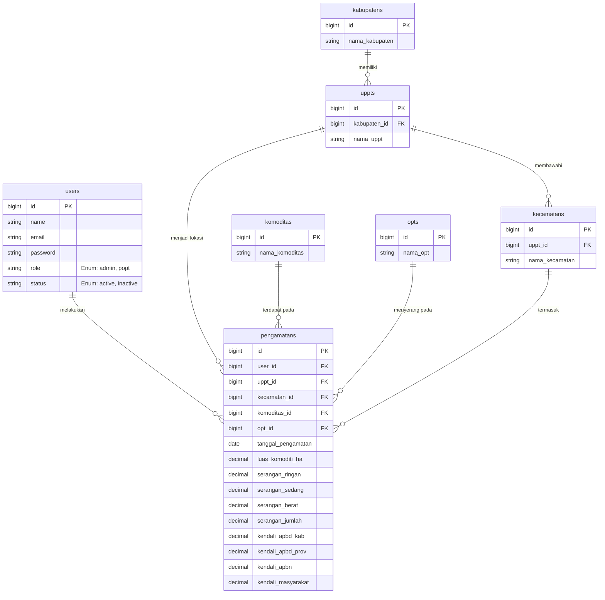
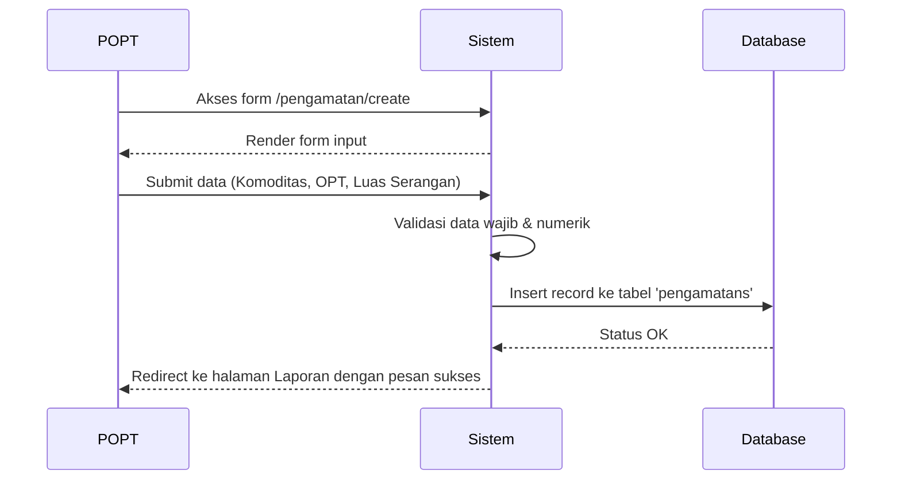

# Dokumen Desain Sistem (System Design Document)
**SIAP-PROTAP (Sistem Informasi Aplikasi Pelaporan - Pengamatan Organisme Pengganggu Tumbuhan)**

---

## 1. Arsitektur Teknologi (Tech Stack)

Aplikasi SIAP-PROTAP dibangun menggunakan arsitektur berbasis *Model-View-Controller* (MVC) dengan spesifikasi teknologi sebagai berikut:
- **Backend / Framework**: PHP dengan kerangka kerja **Laravel 13**.
- **Database**: MySQL, bertindak sebagai *Relational Database Management System* (RDBMS) untuk menyimpan seluruh entitas sistem.
- **Frontend & UI**: 
  - **Blade Templating Engine**: Engine bawaan Laravel untuk memisahkan logika tampilan.
  - **Tailwind CSS**: *Utility-first CSS framework* untuk desain visual yang responsif.
  - **Alpine.js**: Kerangka kerja JavaScript ringan untuk memproses interaksi *client-side* (seperti *dropdown*, *modal*, dan *pagination* responsif).
- **Library Tambahan**: 
  - **Chart.js**: Untuk visualisasi grafik (seperti *Doughnut Chart* pada layar *Dashboard*).

---

## 2. Diagram Relasi Entitas (ERD)

Struktur basis data dirancang untuk menjaga integritas data pengamatan yang terkait dengan pengguna (petugas) dan referensi spesifik wilayah serta komoditas.

### Penjelasan Tabel Basis Data:
1. **users**: Menyimpan data autentikasi petugas dan admin. Kolom `role` menentukan hak akses, dan kolom `status` membatasi login petugas.
2. **pengamatans**: Tabel transaksi utama. Menyimpan data historis pengamatan yang dilakukan petugas di suatu waktu. Terhubung langsung (*Foreign Keys*) ke tabel pengguna, komoditas, OPT, dan lokasi (UPPT & Kecamatan).
3. **Master Data**: Terdiri dari tabel referensi murni (`komoditas`, `opts`).
4. **Data Wilayah**: Disusun berhirarki dari `kabupatens` -> `uppts` -> `kecamatans`. Pengamatan selalu dikaitkan ke spesifik `uppts` (unit pelaksana) yang berada dalam lingkup tersebut.

---

## 3. Alur Sistem (System Flow)

Sistem dirancang dengan keamanan berbasis *Role-Based Access Control* (RBAC).

### A. Alur Otentikasi & Otorisasi
- Pengguna memasukkan kredensial pada halaman `/login`.
- Jika `role = admin`: Sistem memberikan akses ke seluruh menu master data, manajemen pengguna, serta laporan keseluruhan.
- Jika `role = popt`: Sistem membatasi menu master data dan langsung mengarahkan pengguna untuk dapat mengakses form Input Pengamatan.

### B. Alur Pelaporan Pengamatan (POPT)

### C. Alur Pengawasan Dashboard (Admin)
- Admin membuka halaman `/dashboard`.
- Sistem (*DashboardController*) memicu fungsi agregasi basis data:
  - Melakukan *query* menghitung total *Luas Serangan* dari tabel `pengamatans` pada bulan berjalan.
  - Melakukan filter daftar `uppts` yang sudah atau belum menyetorkan baris data pada bulan berjalan.
- Sistem mengembalikan kumpulan data terstruktur ke *View*.
- *View* (*Blade* + *Alpine.js*) merender diagram visual (Chart) dan daftar ter-paginasi (*client-side pagination*) tanpa membebani server secara terus-menerus.

---

## 4. Struktur Komponen (Pola MVC)

Aplikasi dipisahkan secara tegas agar mudah dipelihara dan dikembangkan di kemudian hari (menerapkan prinsip *Separation of Concerns*).

### *Controllers* (Pengendali Logika)
- `DashboardController`: Menghitung metrik (Total Luas Serangan, Persentase Lapor) dengan sintaks *Eloquent ORM*.
- `PengamatanController`: Menangani logika pendaftaran pengamatan baru (validasi luas lahan, intensitas hama) serta memastikan data terikat dengan *user_id* yang menginputnya.
- `LaporanController`: Menangani fungsionalitas ekspor dan pencetakan (*Export to PDF*, *Export to Excel*) serta filter pencarian tanggal.
- Komponen Master (`OptController`, `KomoditasController`, `UpptController`, `UserController`): Menjalankan fungsionalitas manipulasi *CRUD* standar untuk pengayaan opsi pengamatan.

### *Models* (Logika Data)
- Pendefinisian relasi (*Relationships*) antar tabel (contoh: `Pengamatan::belongsTo(User::class)`).

### *Views* (Antarmuka)
- Memiliki *layout* terpusat pada `layouts.app` yang membungkus komponen antarmuka (`layouts.sidebar`, `layouts.topbar`).
- Penggunaan komponen-komponen independen (contoh: `<x-modal>`, `<x-text-input>`) untuk menjamin konsistensi desain UI secara meluruh.
